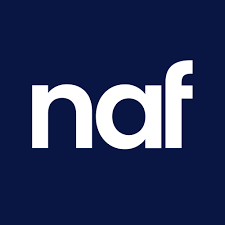
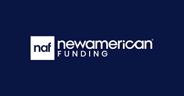
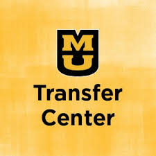
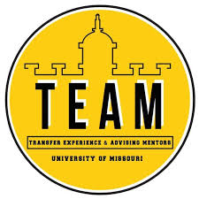

# Jobs 

1. [Home](../ReadMe.md)
2. [Coding](../Coding/Coding.md)
3. [Interests](../Interests/Interests.md)

---

[My LinkedIn](https://www.linkedin.com/in/thegagesmith/)

---

## NAF

### Currently I work remotely for a mortgage company. I started working as an intern and was given the opportunity to continue working for my current company. I have gone from **Intern** to **Jr Developer** to now **Developer** (Jr cutoff).

#### Some technologies and languages I work with are:
- C#
- JSON
- VB.Net
- JavaScript
- SQL
- API's
- Postman
- MS SQL Server
- Mortgage Software
- Plugin (Codebases)
- Webhooks 

 

## Mizzou 

### At Mizzou, I work in the Transfer Center which is within the Student Success Center. I manage logistics for TEAM (Transfer Experience and Advising Mentors) the transfer group on campus. roughly 22% of Mizzou's population is transfer students. I like this job a lot and its nice to get paid for stuff I was already doing.

#### Some objectives that are included in this job are:
- Outreach to other departments, clubs and people
- Creating and managing events on engage
- Creating spreadsheets and documentation
- Tracking attendance data and identifying patterns

 

---